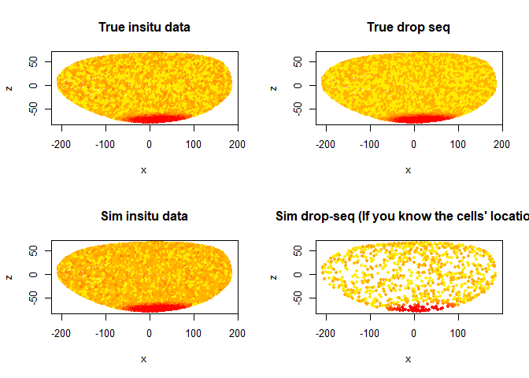
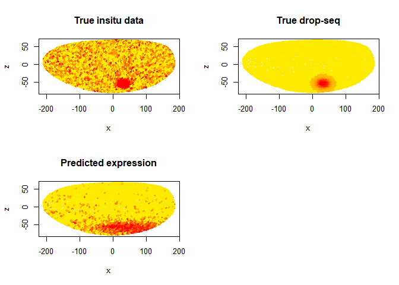

Intro
================
Jiefei Wang
September 23, 2018

Basic functions
===============

Load packages,read functions

``` r
library(mvtnorm, quietly=TRUE)
library(doParallel, quietly=TRUE)
library(DistMap, quietly=TRUE)
setwd(dirname(getwd()))
# read challenge data, plot functions, simulation functions respectively
source("R\\commonFunc\\readData.R")
source("R\\commonFunc\\functions.R")
source("R\\Simulation\\fake\\fake.R")

#register parallel computing
cl=makeCluster(4)
registerDoParallel(cl)
clusterExport(cl,"computeCov")
```

simulation of the true expression pattern
=========================================

``` r
#set gene numbers in insitu, dropSeq dataset. set cell numbers in dropSeq 
refNum=50
geneNum=100
cellNum=1000
#Obtain the simulation parameters
parms=getParms()
#Create true mean expression and dropSeq mean expression
#First refNum column is alway the reference gene in the insitu dataset
patternData=createPattern(chanllege.data$geometry,geneNum,refNum)
#Create insitu mean expression
#Two datasets do not have to measure the exactly same species, may have some gene variation.
#species effect is added in the insitu data. It is controled by parms$speciesDiff
patternData=addSpeciesDiff(patternData,parms)
```

Data simulation
===============

``` r
#Simulate insitu data
sim_insitu=sampleInsituData(patternData,refNum,parms)
#simulate dropSeq data as well as the cell's location
sim_dropSeq_list=sampleDropData(patternData,cellNum,parms)
sim_dropSeq=sim_dropSeq_list$dropData
sim_cellLoc=sim_dropSeq_list$location
```

The first gene
==============

This is the Reference gene in the insitu data

``` r
k=1
geometry=chanllege.data$geometry
par(mfrow=c(2,2))
#Only god knows these plots
intensityPlot2(patternData$insituTable[,k],geometry,title="True insitu data")
intensityPlot2(patternData$trueTable[,k],geometry,title="True drop seq")
#The simulated data, for mortals
intensityPlot2(sim_insitu[,k],geometry,title="Sim insitu data")
intensityPlot2(sim_dropSeq[k,],geometry[sim_cellLoc,],title="Sim drop-seq (If you know the cells' location)")
```



``` r
par(mfrow=c(1,1))
```

Predict the gene expression of the 51th gene
============================================

1~50 genes are in the insitu data so that we don't need to predict them

``` r
k=51
#Normalization, just simply scaling row and column 
sim_dropSeq_normalized=t(apply(apply(sim_dropSeq, 2, scale,center=F), 1, scale,center=F))
row.names(sim_dropSeq_normalized)=row.names(sim_dropSeq)
colnames(sim_dropSeq_normalized)=colnames(sim_dropSeq)
dm = new("DistMap",
         raw.data=as.matrix(sim_dropSeq),
         data=as.matrix(sim_dropSeq_normalized),
         insitu.matrix=as.matrix(sim_insitu>0.1),
         geometry=as.matrix(geometry))
dm <- binarizeSingleCellData(dm, seq(0.15, 0.5, 0.01))
dm <- mapCells(dm)
gene.level.pred = computeVISH(dm, k, threshold=0.75)

par(mfrow=c(2,2))
intensityPlot2(patternData$insituTable[,k],geometry,title="True insitu data")
intensityPlot2(patternData$trueTable[,k],geometry,title="True drop-seq")
intensityPlot2(gene.level.pred,geometry,title="Predicted expression")
par(mfrow=c(1,1))
```


